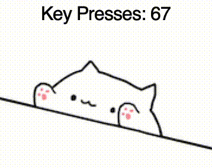
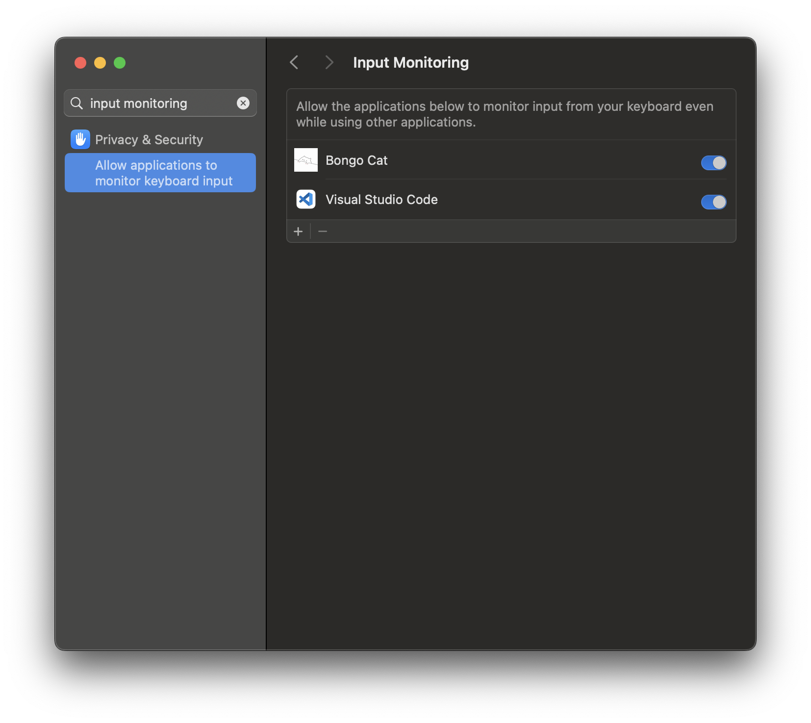

# 🐾 Bongo Cat for Mac 🍎

Inspired by the adorable **Bongo Cat** app on Steam, this lightweight Python-based version brings the same delightful experience to **macOS** — and even tracks your keypresses!

## 🎯 Features

- 🐱 Bongo Cat that bops left and right with every keypress  
- ⌨️ Tracks and displays total number of keypresses  
- 🖼️ Custom images for idle, left tap, and right tap animations
- 💻 Designed to work on **macOS**

## 📚 Libraries Used

- `tkinter` – for GUI interface  
- `Pillow (PIL)` – for image processing  
- `pynput` – for global keyboard event listening  
- `threading` – to run background keyboard listener without freezing the GUI  
- `pyinstaller` – for packaging the app into a standalone executable

## 📸 Preview



## 🚀 Getting Started

### 1. Clone the Repo
```bash
git clone https://github.com/Kyzuma/BongoCatMac.git
cd BongoCatMac
```

### 2. Install Dependencies
Make sure you have Python3 installed, then run:
```bash
pip3 install -r requirements.txt
```

### 3. Add Your Images

Add your own images in the `Images/` folder!

You can design your own or find free Bongo Cat sprites online.

### 4. Run the App
```bash
python3 bongocat.py
```

## ⚙️ Customization

- **Widget size:** Set to `220x220`, but you can change it in this line:
  ```python
  self.top.geometry("220x220")
  ```
- **Placement:** Automatically anchored to bottom-right, but customizable in `place_window_bottom_right()`.

## 🖥️ Packaging with PyInstaller

To create a standalone app, use PyInstaller:

```bash
pyinstaller --onefile --windowed --name "Bongo Cat" --add-data "Images:Images" --icon=icon.icns bongocat.py
```

- `--name` names the Application
- `--windowed` hides the terminal on macOS.  
- `--add-data` bundles the Images folder

After building, find your app inside the dist/ folder.

⚠️ Note: After building, you need to grant Input Monitoring permission to your app for key tracking to work.



## 🚀 Future Improvements

Planned enhancements for **Bongo Cat**:

- 🎉 **Special Effects** every ??? key presses
- 🏅 **Record Personal Best** – track and display your highest number of key presses in a day.

## 📄 License
MIT License — Free to use, modify, and share.

## ✨ Acknowledgements

- Original idea inspired by [Bongo Cat on Steam](https://store.steampowered.com/app/3419430/Bongo_Cat/)  
- Sprite credit: https://imgur.com/a/bongo-cat-diy-0o31WpY
